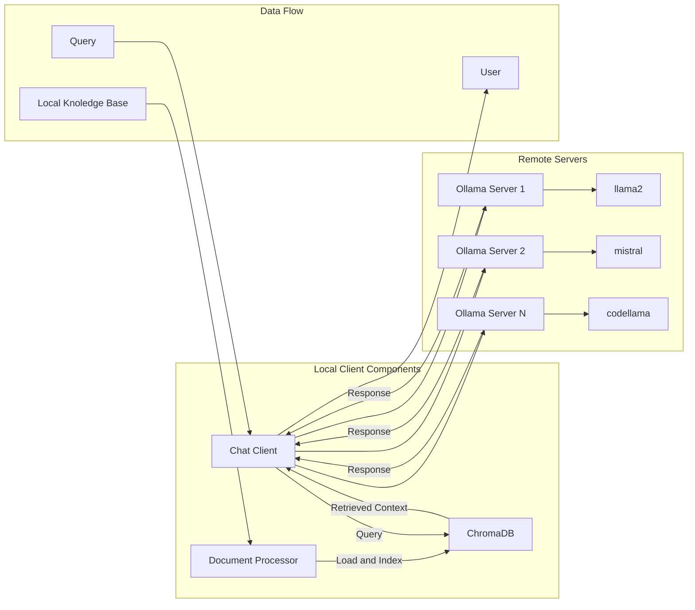

<!-- 
    subgraph Key Components
        KC1[Local Client: Handles document processing, RAG operations, and server communication]
        KC2[Vector DB: Stores document embeddings and enables semantic search]
        KC3[Document Loader: Processes and chunks documents for indexing]
        KC4[Ollama Servers: Host different LLM models for specialized tasks]
        KC5[Configuration: Manages server URLs, model selection, and system settings]
    end

    subgraph Security Layers
        SL1[Nginx Reverse Proxy - not shown - for secure server access]
        SL2[Document encryption in Vector DB]
        SL3[Access control for document retrieval]
        SL4[Rate limiting on server endpoints]
    end
 -->

